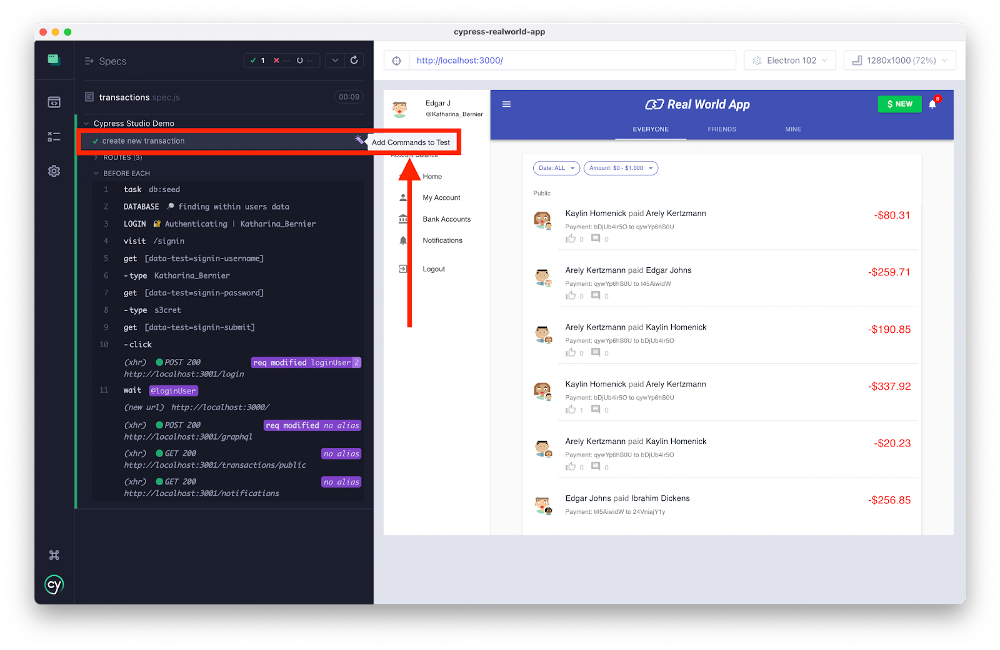

# Automacao-de-testes-para-front-end

## Preparando o projeto

Atualizar

npm i

Abrir o projeto com Cypress

npx cypress open

## Pastas

- Dia 1 : [Introdução a automação e visão inicial de Cypress](cypress\e2e\aula01)

- Dia 2 : [Interagindo com os elementos da página](cypress\e2e\aula02)
  
- Dia 3 : [Verificando os elementos da página](cypress\e2e\aula03)
  
- Dia 4 : [Hooks, depuração e relatórios](cypress\e2e\aula04)

- Dia 5 : [Requisições HTTP e outros recursos](cypress\e2e\aula05)


## Links Importantes

- [Actions: type, click, dbclick, check, select, scrollTo](https://example.cypress.io/commands/actions)

- [Asserts](https://example.cypress.io/commands/assertions)

- [Traversal: children, closest, filter, find](https://example.cypress.io/commands/traversal)

- [Hidden Elements](https://www.tutorialspoint.com/cypress/cypress_hidden_elements.htm)

- [Locators](https://www.tutorialspoint.com/cypress/cypress_locators.htm)


---

### Cypress Studio

Para configurar o Studio, vamos no arquivo `cypress.config.js`:

```javascript
const { defineConfig } = require("cypress");

module.exports = defineConfig({
  e2e: {
    setupNodeEvents(on, config) {
      // implement node event listeners here
    },
    experimentalStudio: true, // Adicionamos esta linha
  },
});


```

Abra o Cypress, escolha o arquivo que deseja e clique na opção "Add Commands to Test" 




